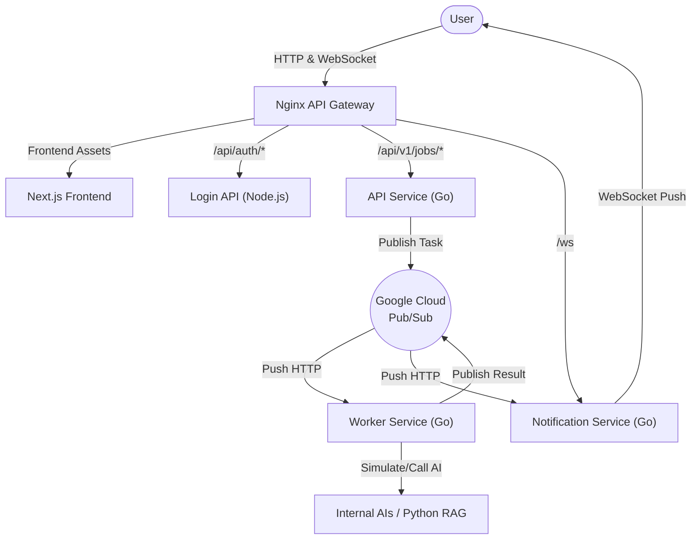

# Tourist assistant

Welcome to the **tourist assistant**! This is an AI-driven, highly scalable platform designed to provide a premium, real-time tourist assistance experience, including personalized travel recommendations, dynamic route planning, and real-time transportation matching.

Originally, this was built during a school subject to introduce a solution for tourists. We have decided to built a system that can ingest given data from vehicle renting hosts and bus routes to generate a list of potential vehicles for a tourist based on user preferences.

## Try it out!

**Local development environment:**
You can access the main application locally at:
 [http://localhost](http://localhost)

The AI renting suggestion feature can be directly accessed at [http://localhost/renting/suggestions](http://localhost/renting/suggestions)

**Public access point:**
 [https://tourism-frontend-app-367022044809.asia-southeast1.run.app](https://tourism-frontend-app-367022044809.asia-southeast1.run.app)

## Features

- **AI-Powered Vehicle Renting & Transportation Matching:** Ingests data from vehicle renting hosts and bus routes to generate personalized vehicle and transportation suggestions for tourists based on their specific preferences.
- **Personalized Travel Recommendations:** Provides tailored suggestions for tourists backed by a recommendation system.
- **Dynamic Route Planning:** Calculates and optimizes travel routes for users to improve their transit experience.
- **Ride Hailing Integration:** Supports real-time ride-hailing coordination for tourists.
- **Real-Time AI Assistance (RAG):** Utilizes a Retrieval-Augmented Generation (RAG) pipeline to provide intelligent, context-aware answers and assistance to tourists.
- **Payment Processing:** Handles transactional workflows necessary for vehicle rentals and ride-hailing services.

## Project Architecture

The application is built on a modern, event-driven microservices architecture optimized for serverless deployments (like Google Cloud Run):

1. **Frontend**: Next.js application providing a premium, cyber-aesthetic user interface.
2. **Nginx API Gateway**: Reverse proxies requests to the appropriate internal services, handling CORS and SSL bridging.
3. **Login Service**: Node.js service handling authentication and session management.
4. **API Service**: Go/Gin service that exposes endpoints to ingest heavy asynchronous tasks and publishes them to the message broker.
5. **Google Cloud Pub/Sub**: The asynchronous, event-driven backbone of the application.
6. **Worker Service**: Go service that consumes jobs via HTTP pushes, interfaces with heavy LLM/RAG pipelines, and publishes results back.
7. **Notification Service**: Go service that manages stateful WebSocket connections with users and pushes real-time AI responses to their browsers.

## Technology stack

- **Frontend**: React, Next.js, Tailwind CSS
- **API Gateway**: Nginx
- **Backend Services**:
  - Go + Gin framework (Async architecture)
  - Node.js + Express (Auth)
  - Python + FastAPI (RAG)
- **Messaging & Real-time**: Google Cloud Pub/Sub, Gorilla WebSockets
- **Databases**: PostgreSQL (with `pgvector` for AI embeddings), MongoDB
- **DevOps**: Docker, Docker Compose, GitHub Actions (CI/CD)

## What we have accomplished

- Built an event-driven microservices architecture optimized for serverless deployments.
- Implemented a premium, cyber-aesthetic user interface using Next.js.
- Developed a scalable backend using Go for high-performance API and worker services.
- Successfully integrated Google Cloud Pub/Sub for heavy asynchronous task processing.
- Engineered a real-time notification system using Gorilla WebSockets to stream AI responses directly to the user.
- Integrated a Python/FastAPI RAG pipeline backed by pgvector for intelligent AI assistance.
- Containerized the entire application stack using Docker and Docker Compose for seamless local development.