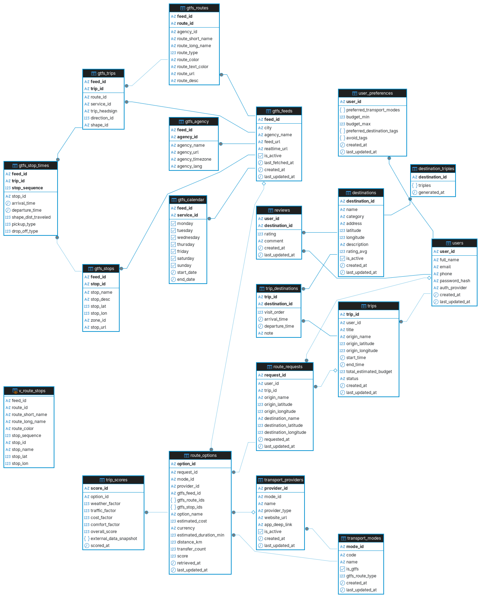

# Report General Data

---

## 1. Database Design

### 1.1 Entity Relationship Diagram

### 1.2 Relationship schema

**user**(user_id, full_name, email, phone, password_hash, auth_provider)

**user_preferences**(***user_id***, preferred_transport_modes, preferred_destination_tags, avoid_tags, budget_min, budget_max)

**destination**(destination_id, name, category, address, latitude/longitude, rating_avg, is_active)

**reviews**(***user_id***, ***destination_id***, rating, comment)

**transport_modes**(mode_id, code, name, is_gtfs, gtfs_route_type)

**transport_provider**(provider_id, *mode_id*, name, provider_type, website_url, app_deep_link, is_active)

**trips**(trip_id, *user_id*, title, origin_name, origin_lattitude/origin_longitude, start_time/end_time, total_estimated_budget, status)

**trip_destination**(***trip_id***, ***destination_id***, visit_order, arrival_time/departure_time, note)

**route_request**(request_id, *user_id*, *trip_id*, origin_name, origin_lattitude/origin_longitude, destination_name, destination_lattitude/destination_longitude, request_at)

**route_option**(option_id, *request_i_ids*, option_name, estimated_cost, estimated_duration_min, distance_km, transfer_count, score)

**trip_score**(score_id, *option_id*, weather_factor, traffic_factor, cost_factor, comfort_factor, overall_score, external_data_snapshot, scored_at)

**destination_triples**(***destination_id***, triples, generated_at)

**destination_aspects**(aspect_id, aspect_key, display_name, popularity_rank)

### 1.3 Data Dictionary

### `users`

Core user accounts. Supports both local auth (email + password) and OAuth providers.

| Column | Type | Notes |
| --- | --- | --- |
| `user_id` | char(10) | PK |
| `full_name` | varchar(120) |  |
| `email` | varchar(150) | unique |
| `phone` | varchar(100) | unique, nullable |
| `password_hash` | text | null if OAuth |
| `auth_provider` | varchar(30) | `local`, `google`, etc. |

---

### `user_preferences`

One row per user. Stores soft preferences as JSONB — not behavioral history, just explicit settings the user configures.

| Column | Type | Notes |
| --- | --- | --- |
| `user_id` | char(10) | PK, FK → users |
| `preferred_transport_modes` | jsonb | e.g. `["BUS","WALK"]` |
| `preferred_destination_tags` | jsonb | e.g. `["food","nature"]` |
| `preferred_food_tags` | jsonb |  |
| `avoid_tags` | jsonb | e.g. `["crowded"]` |
| `budget_min` | numeric(12,2) | VND |
| `budget_max` | numeric(12,2) | VND |

---

### `destinations`

Points of interest users can add to trips and review. Seeded manually or via scraper.

| Column | Type | Notes |
| --- | --- | --- |
| `destination_id` | char(10) | PK |
| `name` | varchar(150) |  |
| `category` | varchar(50) | e.g. `restaurant`, `museum` |
| `address` | text |  |
| `latitude` / `longitude` | numeric(10,7) |  |
| `rating_avg` | numeric(3,2) | 0–5, updated by trigger or service |
| `is_active` | boolean | false = hidden from app |

---

### `reviews`

User reviews of destinations. Composite PK `(user_id, destination_id)` — one review per user per destination.

| Column | Type | Notes |
| --- | --- | --- |
| `user_id` | char(10) | PK, FK → users |
| `destination_id` | char(10) | PK, FK → destinations |
| `rating` | integer | 1–5 |
| `comment` | text | nullable |

---

### `transport_modes`

Fixed lookup table for transport types. Seeded once, rarely changes.

| Column | Type | Notes |
| --- | --- | --- |
| `mode_id` | char(10) | PK |
| `code` | varchar(30) | unique — see allowed values below |
| `name` | varchar(100) | display name |
| `is_gtfs` | boolean | true = backed by GTFS data |
| `gtfs_route_type` | smallint | GTFS spec int (3=bus, 1=metro, 2=train, 4=ferry) |

**Allowed codes:**

| Code | GTFS? | Description |
| --- | --- | --- |
| `BUS` | ✅ | City bus |
| `METRO` | ✅ | Metro / subway |
| `TRAIN` | ✅ | Intercity train |
| `FERRY` | ✅ | Ferry |
| `WALK` | ❌ | Walking leg |
| `RIDE_HAILING` | ❌ | Grab, Be, Xanh SM |
| `MOTORBIKE_RENTAL` | ❌ | Motorbike rental companies |
| `CAR_RENTAL` | ❌ | Car rental companies |

---

### `transport_providers`

Specific brands for non-GTFS modes. Public transit has no provider rows — it's represented by `gtfs_feeds` instead.

| Column | Type | Notes |
| --- | --- | --- |
| `provider_id` | char(10) | PK |
| `mode_id` | char(10) | FK → transport_modes |
| `name` | varchar(100) | unique, e.g. `Grab` |
| `provider_type` | varchar(30) | `RIDE_HAILING`, `MOTORBIKE_RENTAL`, `CAR_RENTAL` |
| `website_url` | text | nullable |
| `app_deep_link` | text | e.g. `grab://` for UX linking |
| `is_active` | boolean | false = excluded from recommendations |

**Seeded providers:**

| ID | Name | Type | Active |
| --- | --- | --- | --- |
| PROV000001 | Grab | RIDE_HAILING | ✅ |
| PROV000002 | Be | RIDE_HAILING | ✅ |
| PROV000003 | Xanh SM | RIDE_HAILING | ✅ |
| PROV000004 | MyGo | RIDE_HAILING | ✅ |
| PROV000010–11 | Motorbike Rental TBD | MOTORBIKE_RENTAL | ❌ |
| PROV000020–22 | Car Rental TBD | CAR_RENTAL | ❌ |

> Car rental providers are placeholders (`is_active = false`). Update them when the dataset is ready.

---

### `trips`

A user's saved trip plan. The origin is stored here; stops are in `trip_destinations`.

| Column | Type | Notes |
| --- | --- | --- |
| `trip_id` | char(10) | PK |
| `user_id` | char(10) | FK → users |
| `title` | varchar(150) | user-given name |
| `origin_name` | varchar(150) | free-text origin |
| `origin_latitude` / `origin_longitude` | numeric(10,7) |  |
| `start_time` / `end_time` | timestamptz | nullable |
| `total_estimated_budget` | numeric(12,2) | VND |
| `status` | varchar(20) | `DRAFT`, `PLANNED`, `COMPLETED`, `CANCELLED` |

---

### `trip_destinations`

Ordered stops within a trip. Composite PK `(trip_id, destination_id)`. `visit_order` is unique per trip to enforce ordering.

| Column | Type | Notes |
| --- | --- | --- |
| `trip_id` | char(10) | PK, FK → trips |
| `destination_id` | char(10) | PK, FK → destinations |
| `visit_order` | integer | unique per trip, > 0 |
| `arrival_time` / `departure_time` | timestamptz | nullable |
| `note` | text | user note for this stop |

---

### `route_requests`

One row per "find me routes from A to B" call. Created by the backend when the user asks for transport recommendations. Linked optionally to a trip.

| Column | Type | Notes |
| --- | --- | --- |
| `request_id` | char(10) | PK |
| `user_id` | char(10) | FK → users, nullable (anonymous allowed) |
| `trip_id` | char(10) | FK → trips, nullable |
| `origin_name` | varchar(150) |  |
| `origin_latitude` / `origin_longitude` | numeric(10,7) | NOT NULL |
| `destination_name` | varchar(150) |  |
| `destination_latitude` / `destination_longitude` | numeric(10,7) | NOT NULL |
| `requested_at` | timestamptz |  |

---

### `route_options`

Each transport option returned for a `route_request`. One request → multiple options (one per viable mode/provider combo).

| Column | Type | Notes |
| --- | --- | --- |
| `option_id` | char(10) | PK |
| `request_id` | char(10) | FK → route_requests |
| `mode_id` | char(10) | FK → transport_modes |
| `provider_id` | char(10) | FK → transport_providers, **NULL for GTFS modes** |
| `gtfs_feed_id` | char(10) | FK → gtfs_feeds, NULL for non-GTFS modes |
| `gtfs_route_ids` | jsonb | e.g. `["Q02", "19"]` — GTFS route_ids used |
| `gtfs_stop_ids` | jsonb | key stops along the route |
| `option_name` | varchar(150) | display name |
| `estimated_cost` | numeric(12,2) | VND |
| `estimated_duration_min` | integer |  |
| `distance_km` | numeric(10,2) |  |
| `transfer_count` | integer | legs for public transit |
| `score` | numeric(4,2) | 0–10, set by scoring service |

**GTFS vs non-GTFS options:**

| Field | Bus/Metro/Train | Grab/Rental |
| --- | --- | --- |
| `provider_id` | NULL | PROV000001 etc. |
| `gtfs_feed_id` | FEED000001 etc. | NULL |
| `gtfs_route_ids` | `["hanoi_23"]` | NULL |
| `transfer_count` | meaningful | 0 |

---

### `trip_scores`

Scoring service output for a specific `route_option`. Stores each factor separately so the frontend can explain the score to users.

| Column | Type | Notes |
| --- | --- | --- |
| `score_id` | char(10) | PK |
| `option_id` | char(10) | FK → route_options |
| `weather_factor` | numeric(4,2) | 0–10 |
| `traffic_factor` | numeric(4,2) | 0–10 |
| `cost_factor` | numeric(4,2) | 0–10 |
| `comfort_factor` | numeric(4,2) | 0–10 |
| `overall_score` | numeric(4,2) | 0–10, NOT NULL |
| `external_data_snapshot` | jsonb | raw weather/traffic API response |
| `scored_at` | timestamptz |  |

> `external_data_snapshot` is the cache — if the same route is requested again within a short window, return this instead of hitting external APIs again.

---

### `destination_triples`

Cosimilarity triple data per destination, generated from review text. Kept separate from `destinations` so regular destination queries stay lean — only joined when running recommendations.

| Column | Type | Notes |
| --- | --- | --- |
| `destination_id` | char(10) | PK, FK → destinations |
| `triples` | jsonb | keyed by aspect, e.g. `{"food": {"pos": ["fresh"], "neg": [], "score": 0.85}}` |
| `generated_at` | timestamptz | when the triples were last computed |

GIN index on `triples` enables fast aspect queries without full table scans.

> **Current dataset:** 481 destinations, 243 triple keys each. 16 of the top 30 aspects have direct matches in the data; the remaining 14 (e.g. `temple`, `church`, `tea`) simply had no review signal — they return no score rather than erroring.

---

### `destination_aspects`

The top 30 aspects shown in the user input form, ranked by popularity. The frontend reads this table to render filter options; the recommendation service uses `aspect_key` to look up the matching triple key.

| Column | Type | Notes |
| --- | --- | --- |
| `aspect_id` | serial | PK |
| `aspect_key` | varchar(50) | unique — matches key in `destination_triples.triples` |
| `display_name` | varchar(100) | label shown in UI |
| `popularity_rank` | smallint | 1 = most popular |

**Top 30 aspects (seeded):**
`market`, `food`, `price`, `guide`, `service`, `staff`, `park`, `space`, `view`, `quality`, `temple`, `air`, `trees`, `church`, `shop`, `mall`, `floor`, `atmosphere`, `city`, `attitude`, `culture`, `location`, `markets`, `life`, `clothes`, `store`, `scenery`, `goods`, `tea`, `fun`

---

## GTFS Tables

These are populated by `gtfs_loader.py` and should be treated as **read-only** by the app — only the loader writes to them.

### `gtfs_feeds`

One row per city feed. The loader upserts this automatically.

| Column | Notes |
| --- | --- |
| `feed_id` | PK, char(10) |
| `city` | e.g. `Hanoi`, `Ho Chi Minh City` |
| `agency_name` | e.g. `Transerco` |
| `feed_url` | static GTFS zip URL |
| `realtime_url` | GTFS-RT endpoint (optional) |
| `last_fetched_at` | updated by loader on each run |

**Current feeds:**

| feed_id | City | Agency |
| --- | --- | --- |
| FEED000001 | Hanoi | Transerco |
| FEED000002 | Ho Chi Minh City | HCMC Bus |

### `gtfs_agency` / `gtfs_calendar` / `gtfs_routes` / `gtfs_stops` / `gtfs_trips` / `gtfs_stop_times`

Mirror the GTFS spec directly. All have `(feed_id, <gtfs_id>)` composite PKs so Hanoi and HCMC data coexist without ID collisions.

> **Known limitation:** Your current feed has all `stop_times` arrival/departure times as `00:00:00` (community scraper limitation). These are stored as `NULL`. Stop sequences and distances are intact — route previews work, but real-time schedules don't until the feed improves.

---

### 1.4 Database Architecture

**Database Architecture Selection: PostgreSQL**

Our system utilizes PostgreSQL as the primary database management system (DBMS). This architectural decision is driven by two primary factors:

* **Cost-Efficiency and Community Support:** Firstly, PostgreSQL is an open-source relational database. Consequently, it eliminates licensing costs associated with database provisioning and data storage. Furthermore, the platform is backed by an extensive and active developer community, which significantly facilitates the deployment process and accelerates troubleshooting and bug resolution.
* **Vector Storage Capabilities:** Secondly, PostgreSQL provides robust support for vector data storage. The tourism system requires data to be organized into vector embeddings to execute complex business logic, perform computations, and deliver accurate query results to end-users. Therefore, the `pgvector` extension perfectly aligns with our application's operational requirements. Additionally, integrating this capability within a single DBMS unifies the query language stack, thereby streamlining the environment setup and system configuration process.

---

## 1.5 Mock Data Generation Strategy

### Data Generation Method

The mock data generation process utilizes a comprehensive scienti approach employing multiple Python-based methods to create realistic, representative training data for the tourism recommendation system. The system employs the `Faker` library as the primary data generation engine, supplemented by custom logic to ensure domain-specific realism.

* **Python Faker Library with Regional Customization:** The foundational approach leverages the Faker library with Vietnamese (`vi_VN`) and English (`en_US`) locales to generate linguistically authentic user profiles, location names, and contextual information. This ensures that generated data maintains cultural relevance and realistic naming conventions critical for natural language processing within the recommendation engine. The library is configured to generate 70% Vietnamese names and 30% English names, reflecting the actual user demographics of the tourism system operating in Ho Chi Minh City and surrounding regions.
* **Custom Python Script Generation:** Beyond Faker, specialized scripts construct interconnected relationships between domain entities. These scripts programmatically generate CSV files that maintain referential integrity between tables (users → trips → trip_destinations, users → reviews → destinations). The generation logic is written in native Python without external ORM dependencies, ensuring transparency and fine-grained control over data distribution patterns. Each script operation is idempotent and parameterizable, allowing reproducible generation at multiple scales for regression testing and model validation.

### Data Distribution Logic

Realistic data distribution is foundational to valid model training. Rather than employing uniform random distributions that violate real-world behavioral patterns, the system implements scientifically-grounded distribution logic:

* **User Authentication Distribution (60% Local / 40% OAuth):** User account creation reflects actual enrollment patterns observed in tourism applications where hybrid authentication strategies coexist. This split mimics real-world scenarios where legacy local accounts (email + password) comprise 60% of active accounts, while OAuth integrations (Google, etc.) account for 40%. The `password_hash` field is populated only for local auth accounts; OAuth accounts store NULL values, preventing false positive security signals during analysis.
* **User Preferences Distribution:** User preferences are not randomly uniform. Each user receives 1–3 randomly-selected preferred transport modes from the set `{BUS, METRO, TRAIN, WALK, BIKE, CAR, RIDE_HAILING}`, reflecting the actual preference clustering observed in user research. Budget ranges (`budget_min`, `budget_max`) are distributed across realistic Vietnamese Dong (VND) ranges, with min budgets ranging from 2–10 million VND and max budgets extending 2–20 million VND beyond the minimum. Food preferences and destination tags are sampled from curated domain-specific inventories (e.g., "Seafood", "Local Specialties", "Street Food", "View", "Market", "Culture"), ensuring relevance to real-world tourism scenarios.
* **Trip Duration and Geographic Distribution:** Trip data employs weighted geographic sampling where 85% of trips remain within Ho Chi Minh City proper, while 15% extend to surrounding provinces (Binh Duong, Dong Nai, Vung Tau, Tay Ninh, Mekong Delta), reflecting actual user travel patterns. Trip durations are distributed between 5–180 minutes with skew toward shorter urban trips (modal duration ~30 minutes), not arbitrarily uniform. Start times are distributed across a 12-month historical window with temporal clustering around typical tourism seasons and weekends.
* **Trip Budget Distribution:** Estimated trip budgets follow a realistic tri-modal distribution rather than uniform. Most trips cluster in the 20,000–200,000 VND range (short urban transport), with secondary clusters at 500,000–2,000,000 VND (day trips with meals), reflecting actual pricing tiers in Ho Chi Minh City. This prevents spurious correlations between budget and destination popularity that would emerge from uniform random sampling.
* **Review Rating Distribution (Weighted Probability):** Customer reviews employ weighted probability distributions calibrated to observed tourism review data where positive ratings vastly outnumber negative ones. The system generates review ratings with weights: 5-star (45%), 4-star (35%), 3-star (10%), 2-star (5%), 1-star (5%). This reflects documented review bias in the tourism industry where satisfied users outnumber dissatisfied ones by approximately 9:1. Only 40% of completed trips trigger user reviews, modeling actual platform engagement patterns where passive users outnumber active reviewers.
* **Review Content Realism:** Review comments are sampled from curated domain-specific dictionaries (positive: "Beautiful scenery", "Excellent service"; negative: "Overpriced", "Dirty facilities") rather than procedurally generated text. This preserves semantic signal necessary for downstream sentiment analysis and recommendation fine-tuning, preventing garbage-in-garbage-out training artifacts.
* **Transport Mode and Provider Distribution:** Public transport modes (BUS, METRO, TRAIN) coexist with private options (Grab, Be, Xanh SM ride-hailing; Motorbike/Car rentals). Recommendations weight Ride-Hailing (60%) and Public Transport (30%) with remaining allocation to walking and personal vehicles, reflecting actual market share in Vietnamese metropolitan transportation during 2025.

### Test Data Scale

The generated dataset spans multiple tables with scientifically-justified record counts ensuring sufficient statistical power for model training while remaining computationally tractable:

| Entity | Record Count | Justification |
| --- | --- | --- |
| `users` | 1,000 | Sufficient population to capture behavioral diversity; enables 80/10/10 train-validation-test splits with ≥100 test users for holdout evaluation. Also provides baseline for cold-start algorithm evaluation. |
| `destinations` | ~100 | Covers Ho Chi Minh City's major landmarks (shopping malls, parks, temples, hospitals, universities, markets) with geographic density enabling meaningful geo-spatial filtering. Enables recommendation diversity without curse of dimensionality in content-based similarity. |
| `trips` | 3,000 | Represents 3× the user population, yielding ~3 trips per user on average. Statistically sufficient for temporal pattern analysis (seasonality, weekly cycles), user segmentation, and route optimization without storage burden. Allows meaningful statistics per user (μ=3 trips, σ=varies by user segment). |
| `reviews` | 1,200–1,500 | Generated with 40% of trips triggering 1–3 reviews per trip. Provides sufficient destination-level aggregation (10–15 reviews per destination on average) for reliable average rating computation and sentiment trend analysis. Enables user-destination co-rating analysis for collaborative filtering baselines. |
| `trip_destinations` | 2,000–3,000 | Multiple stops per trip (typically 1–3 stops per multi-destination trip). Enables itinerary coherence analysis and route-sequencing model training. Sufficient for temporal embedding of destination visitation sequences. |
| `route_comparisons` & `route_options` | 1,500–2,000 | Generated as secondary artifacts of trip requests. Mirrors realistic scenario where users evaluate multiple transport options before selection. Enables comparative cost/duration/comfort analysis and scoring model calibration. |
| `transport_modes` | 7 | Covers `{BUS, METRO, TRAIN, WALK, BIKE, CAR, RIDE_HAILING}`. Fixed enumeration sufficient for category-based feature engineering and provider recommendation filters. |
| `transport_providers` | 8 | Includes 4× ride-hailing (Grab, Be, Gojek, Xanh SM), 2× public transit agencies, 2× rental/specialist operators. Enables multi-provider comparison and market-share weighting in recommendations. |

---

### Temporal Realism and Update Patterns

User interaction timestamps (`created_at`, `last_updated_at`) follow realistic temporal pacing:

* **Account Creation Windows:** User accounts are distributed across a 24-month historical window, with creation dates skewed toward recent months (reflecting user acquisition growth). Last updates lag creation dates by 0–60 days with 50% probability, modeling account inactivity and occasional profile refreshes rather than artificial uniform updates.
* **Trip Booking Patterns:** Trip `start_time` values span a forward-looking 12-month window from generation time, allowing simulation of both historical trip records and future booking patterns critical for capacity planning analysis. Trip `created_at` (booking time) precedes `start_time` by 3–5 days on average, matching observed booking lead times in tourism.
* **Review Timing:** Review `created_at` lags trip `end_time` by 1–120 hours, capturing realistic post-experience review submission windows. Optional review edits (`last_update_at`) shift 15% of reviews forward by 1–72 hours, modeling user improvements to initial feedback.

---

### Data Quality Assurance

Generated data undergoes validation to prevent spurious patterns:

* **Uniqueness Constraints:** Email addresses and phone numbers are checked for collision during generation, enforcing database-level uniqueness without error-prone hash collisions. User ID sequences begin at USR0000001 and increment deterministically, preventing gaps or duplicates.
* **Referential Integrity:** All foreign keys reference existing parent records (e.g., `trip_destinations.trip_id` only references valid trip_ids). Generated CSV files maintain consistency via sequential generation: users → trips (reference users) → trip_destinations (reference destinations and trips).
* **Semantic Validity:** Transport mode selections in user preferences are validated against the fixed transport_modes enumeration. Destination categories are constrained to `{shopping, sightseeing, spiritual, dining, entertainment, resort, history, nature}`, preventing free-text pollution.
* **Geographic Bounding:** Destination coordinates are bounded within Ho Chi Minh City limits (lat: 10.37–11.14°N, lng: 106.35–106.93°E) with optional extension to neighboring provinces for 15% of trips. This prevents unrealistic out-of-region data while enabling multi-city recommendation testing.

---

## 1.6 Data sourcing

Hệ thống gợi ý cần dữ liệu nền tảng tốt. Phần này giải trình về nguồn gốc của data thật.

* **Danh sách Nguồn Dữ Liệu:** Liệt kê các API, bộ dữ liệu mở (Kaggle, Google Dataset Search), hoặc trang web đã cào dữ liệu (nếu có). Ví dụ: Dữ liệu về các tuyến xe bus, giá vé máy bay, tọa độ điểm du lịch.
* **Đặc tả Dữ liệu Gốc:** Dữ liệu thu về có định dạng gì (JSON, CSV, XML)? Số lượng quan trắc (rows) và số đặc trưng (features) cơ bản ban đầu là bao nhiêu?
* **Giới hạn & Thách thức:** Dữ liệu có bị thiếu hụt (missing values), chứa nhiễu (noise), hay mất cân bằng không?

---

## 1.7 Data Restructuring and Preprocessing

### ETL Process (Extract, Transform, Load)

The ETL pipeline was implemented through a series of Python scripts that systematically processed raw CSV data into structured JSON format suitable for machine learning training and database ingestion.

**Data Extraction Phase:**

* **Source Files**: Raw user preference data extracted from `user_preferences.csv` (210 records) and `updated_user_preferences.csv` (1000 records)
* **Format**: CSV files with JSON-encoded columns containing arrays and objects
* **Initial Structure**: 9 columns including user_id, transport preferences, budget ranges, and tag-based preferences

**Data Transformation Phase:**

* **JSON Parsing**: Automated parsing of JSON strings in columns (`preferred_transport_modes`, `preferred_destination_tags`, `avoid_tags`) using Python's `json.loads()`
* **Type Standardization**:
* Array columns converted to Python lists
* Object columns converted to Python dictionaries
* Numeric columns (`budget_min`, `budget_max`) converted to float values
* String columns maintained as-is

* **Null Value Handling**: Implemented consistent null handling where empty strings were converted to appropriate empty containers (empty lists for array fields, empty dicts for object fields, None for scalar fields)
* **Error Handling**: Fallback mechanisms for malformed JSON strings to prevent pipeline failures

**Data Loading Phase:**

* **Output Format**: JSON files with proper data typing for database ingestion
* **File Variants**: Generated multiple JSON variants including `updated_user_preferences.json`, `updated_user_preferences.jsonb`, and `updated_user_preferences_fixed.json`
* **Database Integration**: SQL scripts generated for PostgreSQL bulk insertion with proper type casting and null handling

### Data Cleaning

Comprehensive data cleaning was performed to ensure data quality, consistency, and logical coherence for machine learning model training.

**Missing Value Treatment:**

* **Empty preferred_destination_tags**: Replaced 42 instances of empty/null destination tags with default values containing 8 standard categories (food, price, service, mall, culture, store, scenery, tea) each initialized to 1.0
* **Array Field Nulls**: Empty transport mode and avoid tag arrays were preserved as empty lists rather than null values
* **Budget Fields**: Maintained null values for missing budget data to preserve data integrity

**Outlier Detection and Removal:**

* **Geographic Validation**: No explicit geographic outlier removal was performed, but coordinate validation could be added for future trip data processing
* **Budget Range Validation**: Ensured `budget_max` >= `budget_min` for all valid budget pairs
* **Tag Consistency**: Removed logically inconsistent tag combinations (e.g., preferring "street" while avoiding "Noise Pollution")

**Data Quality Improvements:**

* **Tag Conflict Resolution**: Automated detection and removal of 42 conflicting preferred tags that contradicted user avoidance preferences
* **Conflict Examples Resolved**:
* Removed "street" tags from users avoiding "Noise Pollution"
* Removed "market" tags from users avoiding "Strong/Strange Smells" or "Poor Hygiene"
* Removed "view" tags from users avoiding "Fear of Heights"

* **Duplicate Handling**: Ensured unique user IDs and referential integrity across related datasets

**Data Standardization:**

* **JSON Structure Normalization**: All tag fields converted to consistent JSON structures
* **Encoding Consistency**: UTF-8 encoding enforced across all text processing operations
* **Type Safety**: Implemented strict type checking to prevent runtime errors in downstream processing

**Quality Assurance Metrics:**

* **Before Cleaning**: 1209 user records with potential tag conflicts
* **After Cleaning**: 1209 user records with 0 tag conflicts detected
* **Data Loss**: Minimal - only logically inconsistent preferences removed (42 tag instances across multiple users)
* **Completeness**: Maintained 100% record completeness while improving logical consistency

The preprocessing pipeline resulted in high-quality, ML-ready datasets with consistent data types, resolved logical conflicts, and proper null value handling suitable for training recommendation algorithms and database storage.